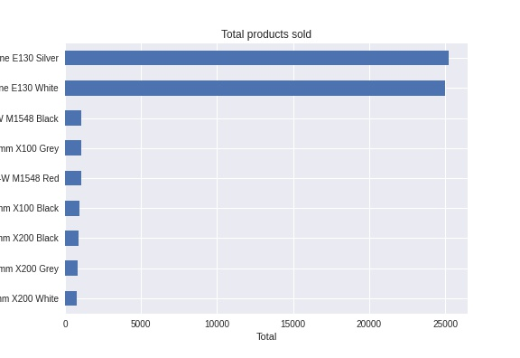
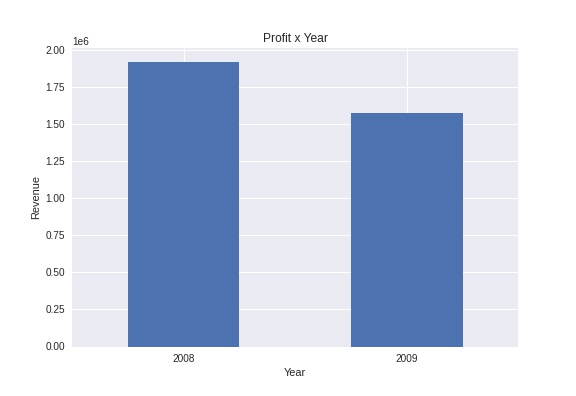
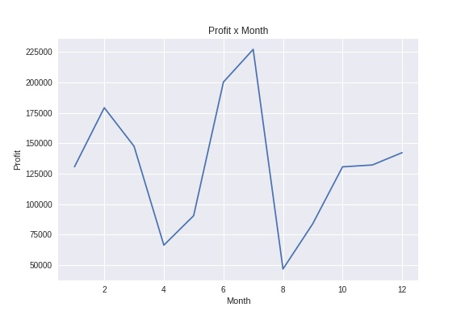
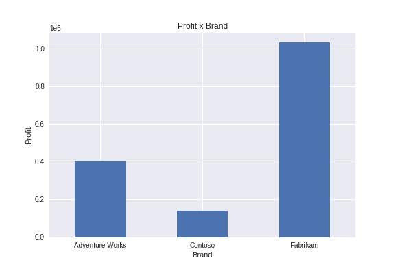
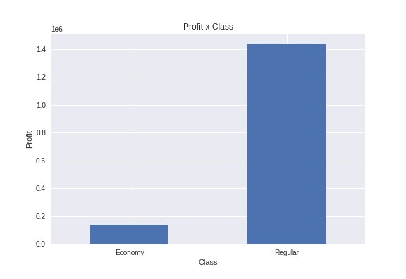
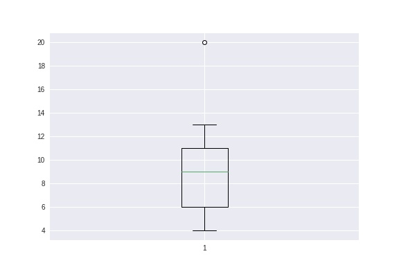
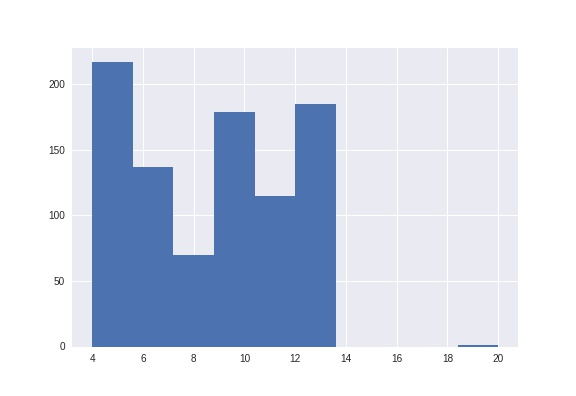

# Adventure Works Sales Data Analysis Report

### This report was generated automatically by the python routine that has the task of analyzing the Adveture Works sales data.
### In addition, statistical results will be presented

### - 1st analysis: to determine the total revenue, cost and profit for the available data.

**************************
Total revenue:  5984606.14

Total cost:     2486783.05

Total profit:   3497823.09

**************************

### - 2nd analysis: to calculate the average of shipping time by Brand

| Brand           |   Shipping_time |
|:----------------|----------------:|
| Adventure Works |         8.66387 |
| Contoso         |         8.47093 |
| Fabrikam        |         8.51012 |

### - 3rd analysis: the profit group by the Year and Brand

|                           |           Profit |
|:--------------------------|-----------------:|
| (2008, 'Adventure Works') | 306641           |
| (2008, 'Contoso')         |  56416           |
| (2008, 'Fabrikam')        |      1.55702e+06 |
| (2009, 'Adventure Works') | 405395           |
| (2009, 'Contoso')         | 138259           |
| (2009, 'Fabrikam')        |      1.03409e+06 |

### - 4th analysis: the total product sold the following by a bar plot of this result

| Product                                         |   Quantity |
|:------------------------------------------------|-----------:|
| Headphone Adapter for Contoso Phone E130 Silver |      25232 |
| Headphone Adapter for Contoso Phone E130 White  |      25008 |
| Adventure Works Laptop15.4W M1548 Black         |       1089 |
| Fabrikam Trendsetter 2/3'' 17mm X100 Grey       |       1087 |
| Adventure Works Laptop15.4W M1548 Red           |       1047 |
| Fabrikam Trendsetter 2/3'' 17mm X100 Black      |        926 |
| Fabrikam Trendsetter 1/3'' 8.5mm X200 Black     |        884 |
| Fabrikam Trendsetter 1/3'' 8.5mm X200 Grey      |        845 |
| Fabrikam Trendsetter 1/3'' 8.5mm X200 White     |        789 |

### - 5th analysis: the following figure shows a bar plot of the profit per year

|   Date Sale |      Profit |
|------------:|------------:|
|        2008 | 1.92008e+06 |
|        2009 | 1.57775e+06 |

### - 6th analysis: the following figure shows the profit per month in the year of 2009

### - 7th analysis: the following figure shows a bar plot of the profit per brand in the year of 2009

### - 8th analysis: the following figure shows a bar plot of the profit per class in the year of 2009

### - 9th analysis: the following table shows some statistics about the shipping time and the following figures show its boxplot and a histogram

|       |   Shipping_time |
|:------|----------------:|
| count |       904       |
| mean  |         8.54314 |
| std   |         3.05692 |
| min   |         4       |
| 25%   |         6       |
| 50%   |         9       |
| 75%   |        11       |
| max   |        20       |

